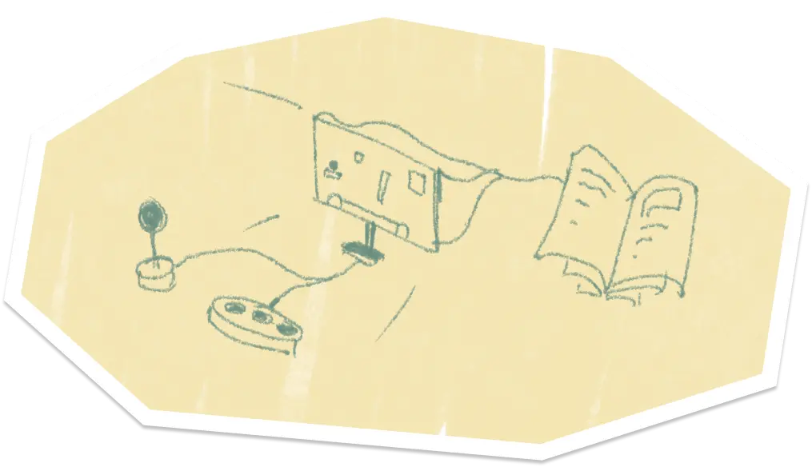
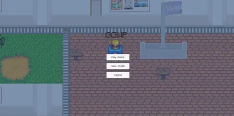
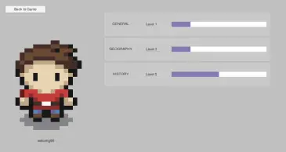
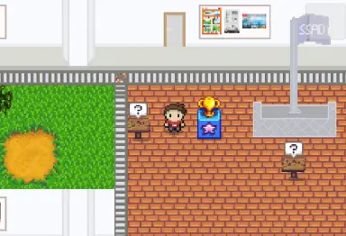
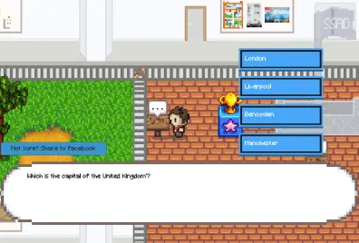
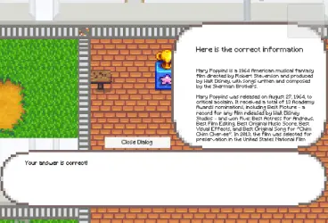
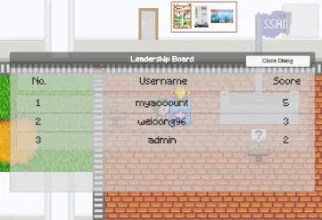
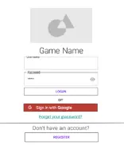
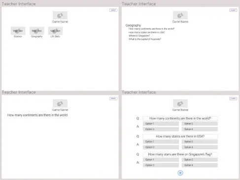

# GGWP

It is one of the [NTU](https://www.ntu.edu.sg/)'s CZ3003 Software System Analysis and Design Module Project

## What?

We are tasks to developed an application comprehensive enough to apply Software Development Life Cycle (SDLC) with multiple system integrated.

## Why?

To apply software and system engineer practices and processes we learnt from this module

## How?

Software Project Management

1. Work breakdown evaluation
2. Project plan
3. Requirement specification
4. Design specification
5. Software development life cycle evaluation

Software UI/UX Design

1. Requirement understanding
2. UI Design
3. UI Flow
4. UI Prototyping and surveying

Software Development

1. Idealise and Formulate possible applications for development
2. Draft possible requirements and features
3. Defined problem statement, purpose, scope, people of interest, assumption and constraint, dependencies, references, operating tools and environments, data dictionary
4. Defined functional and non-functional requirements, use-case models and descriptions, class diagrams, dialog, sequence, diagram
5. Design and Defined UI, UI Flow
6. Design and Defined Software Architecture, possible Patterns
7. User Acceptance Test (UAT), White and Black box testing
8. Code readability, version control, standardised documentation, modularity consideration
9. Code implementation, documentation, testing, integration, deployment, release

System Development

1. Defined and design system relations
2. Implement system APIs

## Highlights

Student Role

Teacher Role (Admin)

## Disclaimer

All external data and assets used in this project is intended for educational purpose only.

## Contributor

Good Game Well Played (GGWP) Team
